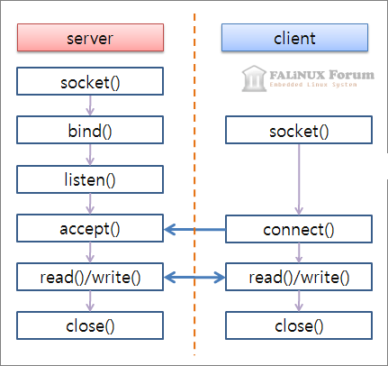
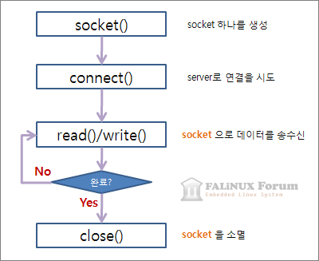

## Python Cplusplus IPC 
Between Python(Client) process and C++(Server) process inter communication by socket file(.sock). 

### Usage
- You should run C++ process before run Python process.
- C++ server run infinitely, Python Client run once.

### My Setting
`HOST = localhost` 
`PORT = 5000` 
`SOCKET_PATH = "/home/yoonje/PycharmProjects/python_socket/C++server/server.dat"`

### Socket Progress
- TCP/IP communication function order 

- Server 

- Client 

